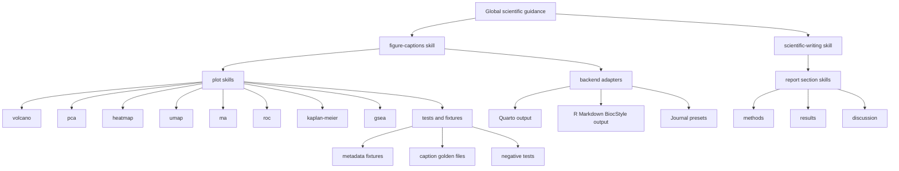
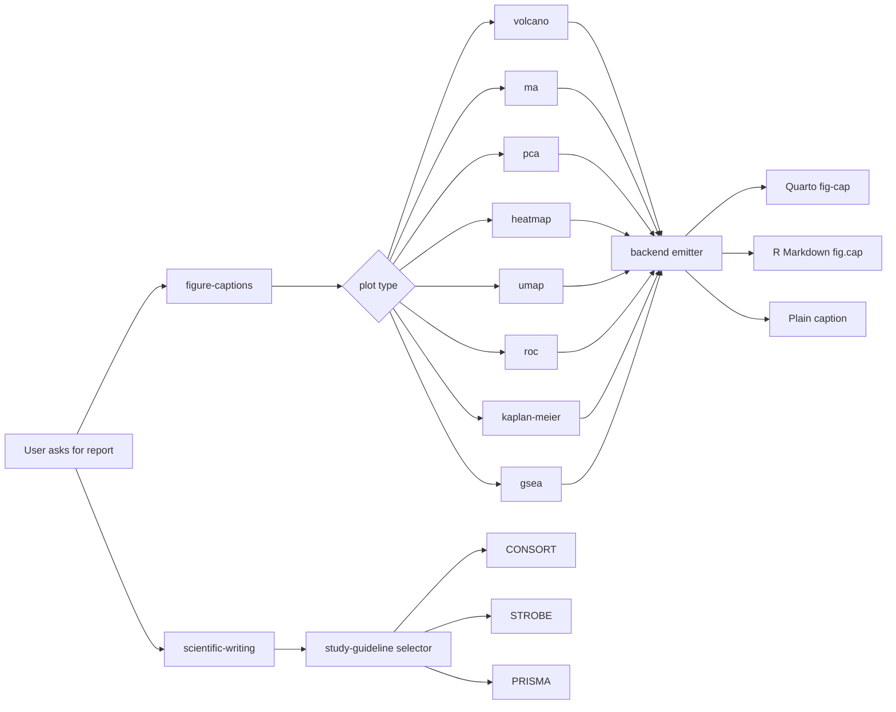

# Reusable AI Skills for Scientific Automatic Report Generation

## Executive summary

The strongest starting point for a reusable scientific-report skill repository is **not** the R ecosystem alone. It is the newer **Agent Skills ecosystem** that has converged around `SKILL.md`-style packages, plus adjacent systems for always-on instructions (`AGENTS.md`, Cursor rules, Continue rules) and prompt registries (LangSmith Prompt Hub, PromptSource, Hugging Face prompt corpora). The common pattern is a **small metadata layer for discovery**, a **Markdown instruction body for the reusable procedure**, and **optional scripts/references/assets** that are loaded only when needed. That pattern now appears in Anthropic Claude Code, OpenAI Codex, GitHub Copilot, Hugging Face Skills, Google’s official skills repo, and the cross-vendor Agent Skills specification. citeturn19view3turn19view1turn27view0turn39search17turn39search0turn40view3turn40view2

For your specific goal, the important finding is that **scientific-writing and bioinformatics skill collections already exist**, but they are usually organized around whole workflows such as “academic writing,” “Kaplan–Meier analysis,” or “single-cell analysis,” rather than a **clean, testable library of plot-caption skills**. There are repositories for manuscript review, academic-writing pipelines, bioinformatics workflows, and medical-research skills, and some of them already embed figure-caption guidance or graph-interpretation logic. However, I did not find a widely adopted repository whose primary abstraction is: **one plot type = one caption/reporting skill with explicit metadata requirements, anti-overclaim rules, and automated tests**. That gap is exactly where a reusable “scientific automatic report” skill repo can differentiate. This assessment is an inference from the repositories below, which are substantial but mostly broader in scope. citeturn25view4turn25view5turn26view0turn26view1turn25view6turn26view2turn36search3turn36search17

The best design choice is therefore a **hybrid architecture**: use the **Agent Skills format as the portable core**, encode **journal/Bioconductor/Quarto conventions** in shared reference skills, and add **Quarto/RMarkdown adapters** so the same caption logic can be emitted as `fig-cap`, bookdown/BiocStyle `fig.cap`, or agent-native output. That lets the same repository serve Codex, Claude Code, GitHub Copilot, Cursor-compatible workflows, Continue, and future registries while still fitting naturally into Quarto and Bioconductor-centric report generation. citeturn40view3turn40view2turn19view1turn19view3turn27view1turn20search0turn21view0turn31view0turn30view6turn30view7

The core scientific rule set should be conservative: captions should be **self-contained**, specify **what is shown rather than what is “proved,”** define **symbols, units, error bars, and statistical tests**, and report **exact sample sizes when statistics are shown**. Those rules are directly supported by Nature, PLOS, Science, Cell, BiocStyle, Quarto, and major reporting-guideline systems such as CONSORT, STROBE, and PRISMA. citeturn30view0turn30view1turn30view2turn30view3turn18search0turn18search1turn31view0turn30view6turn32view2turn32view3turn32view1

The practical recommendation is to implement the repository in phases: first a **portable core** of generic scientific-writing and figure-caption skills; then **eight high-priority plot skills**; then **style-guide adapters** for Quarto, R Markdown, and journal-specific presets; then **test fixtures and CI**; then **discovery/packaging** through GitHub, `gh skill`, skills registries, and plugin packaging. That sequence matches the current ecosystem and minimizes lock-in. citeturn27view1turn10search0turn10search3turn27view2turn40view1turn28view1

## Ecosystem inventory

The table below focuses on the repository and platform families that matter most for a reusable scientific-skill library.

| Ecosystem | Primary unit | Metadata / schema | Composition / inheritance | Discovery / distribution | Versioning / testing | Relevance for your repo | Sources |
|---|---|---|---|---|---|---|---|
| **Agent Skills open standard** | `skill-name/SKILL.md` with optional `scripts/`, `references/`, `assets/` | Required `name`, `description`; optional `license`, `compatibility`, `metadata`, `allowed-tools`; validation via `skills-ref` | Progressive disclosure: startup metadata, full body on activation, resources on demand | Cross-vendor standard; registries and clients can implement it | Supports validation; encourages short bodies and external references | Best portable substrate for a scientific skill repo | citeturn40view3turn40view2turn40view1 |
| **Claude Code skills** | `SKILL.md` and `.claude/skills/*` | YAML frontmatter; Claude extends the standard with invocation control, `allowed-tools`, `disallowed-tools`, subagent patterns | Automatic or explicit invocation; can run in subagents; project/plugin/managed scopes | Official plugin marketplace and project-scoped sharing | `skill-creator` supports trigger/output evals, A/B comparison, and benchmark files | Strongest current authoring UX for procedural skills | citeturn19view3turn29view1turn29view2turn29view4 |
| **OpenAI Codex skills** | `SKILL.md` plus optional resources; plugins for installable distribution | Needs `name` and `description`; open-standard compatible; hosted API also treats a skill as a versioned bundle | Progressive disclosure; AGENTS layering for always-on guidance; skills for task-specific procedures | CLI, IDE, app, hosted shell; plugins package skills and apps | OpenAI recommends explicit evals for trigger, process, style, and efficiency | Excellent fit if user will scaffold via Codex | citeturn19view1turn28view0turn28view1turn28view2 |
| **GitHub Copilot skills and plugins** | `SKILL.md` in `.github/skills`, `.claude/skills`, or `.agents/skills`; `plugin.json` for installable bundles | Open-standard `SKILL.md`; plugins bundle skills, agents, hooks, MCP, LSP | Combine repo instructions with skills; custom agents offload work to subagents | `gh skill`, plugin marketplaces, GitHub UI, IDEs | Versioning through Git and plugin packaging; no first-class skill eval standard in docs | Good downstream target for adoption and distribution | citeturn27view0turn27view1turn27view2turn22search5 |
| **Cursor rules and skills** | `.cursor/rules/*.mdc`, AGENTS.md, and Agent Skills support | Rules are persistent instructions; official docs also advertise Agent Skills support | Hierarchy of project, team, user rules plus AGENTS/skills | Shared via repos such as `awesome-cursorrules` and native Cursor surfaces | Community-heavy; testing mostly external/manual | Useful as an adapter target, but less ideal as canonical source format | citeturn20search0turn20search1turn25view1 |
| **Continue rules and prompts** | `.continue/rules/*` and markdown prompts with frontmatter | Rules guide Agent/Chat/Edit modes; prompts can be `invokable: true` slash commands | Rules are concatenated into system message; prompts act as user-message kickoffs | Config and prompt packages; CLI and IDE use | Versioning via Git; no specialized skills packaging | Good for a compatibility layer, not the main repository schema | citeturn21view1turn19view5turn21view0 |
| **MCP prompt servers** | Prompt definitions exposed by servers | `name`, optional `title`, `description`, optional `arguments`; `prompts/list` and `prompts/get` | Explicit, user-controlled invocation; prompt arguments are first-class | Discoverable through MCP-capable clients and registries | Protocol-level structure, not content-quality testing | Valuable for runtime discovery and argumentized prompt delivery | citeturn37view3 |
| **LangSmith Prompt Hub** | Prompt objects with commit history | Prompt content plus tags, owners, environments, webhooks | Environment pointers (`staging`, `production`) and tag-based promotion | Public prompt hub and SDK pull-by-tag | Strong built-in versioning, rollback, webhook integration | Excellent for prompt/version ops, less ideal for multi-file scientific skills | citeturn23view0turn23view1 |
| **PromptSource / Hugging Face prompt corpora** | Dataset-linked prompt templates, often YAML/Jinja | Template plus associated metadata and evaluation metrics | Template inheritance is dataset-centric rather than agent-centric | Hugging Face datasets and GitHub repo | Good for corpus-scale prompt authoring; not skill-native | Useful as inspiration for metadata discipline and test fixtures | citeturn38search0turn38search3turn38search5turn38search8turn38search11 |
| **Awesome lists and community indices** | Curated lists of prompts/skills/rules | Usually light metadata; quality varies | Mostly collection, not inheritance | GitHub lists, websites, registries | Versioned via Git; testing inconsistent | Excellent discovery layer, weak canonical schema | citeturn25view2turn39search1turn38search7turn38search4 |

Two structural patterns stand out.

First, the market is converging on a separation between **always-on project guidance** and **task-specific reusable procedures**. `AGENTS.md`, Copilot instructions, Cursor rules, and Continue rules are meant for general repository norms, while skills are meant for procedures that should load only when relevant. That distinction matters for your repo: general authorial norms belong in `scientific-writing.md` and `figure-captions.md`, while plot-specific instructions belong in separate plot skills. citeturn28view2turn19view1turn27view1turn20search0turn21view1

Second, the most mature systems now emphasize **progressive disclosure**. The agent only needs short descriptions to decide whether to activate a skill; details and references should stay out of the default context until called. This is especially important for scientific writing, where style guides, journal rules, and plot semantics are verbose. A caption skill repo should therefore keep `SKILL.md` short and move examples, style-check tables, and journal-specific references to `references/`. citeturn40view2turn7search3turn19view1turn19view3

A third practical observation is that distribution is already becoming package-like. Skills can be installed through skills registries, GitHub Copilot tooling, or plugin bundles, and OpenAI’s API treats hosted skills as **versioned bundles of files**. That argues for treating your repository as a **source package with deterministic releases**, not just a loose prompt collection. citeturn10search0turn10search3turn10search2turn27view2turn28view0

## Scientific-writing and caption-skills landscape

There is already real prior art for scientific AI skills, but most of it clusters into four categories: **manuscript-writing skills**, **workflow/domain libraries**, **curated scientific-skill indices**, and **graph/figure interpretation skills**. The implication is encouraging: you are not early to the idea of scientific skills, but you are early to the narrower idea of **plot-caption skills as reusable, testable reporting modules**. citeturn25view4turn25view5turn26view0turn26view1turn25view6turn26view2turn26view3

On the manuscript side, `labarba/sciwrite` packages a writing-review skill grounded in Stanford’s *Writing in the Sciences* methodology; `academic-writing-toolkit` targets reading, writing, and managing academic research across multiple agent platforms; `academic-research-skills` covers the whole research-to-publication pipeline and is already installable as a plugin; and `SFETNI/Scientific-Writing-Skills-Claude-Code-Codex` is explicitly framed as a human-in-the-loop quality-control system that rejects fabricated findings and overclaiming. These are high-value upstream inspirations for tone, workflow, and review logic. citeturn25view4turn26view0turn26view1turn25view5

On the domain-library side, `GPTomics/bioSkills` aims to teach agents bioinformatics workflows end to end; `medical-research-skills` organizes hundreds of skills across evidence, protocol design, data analysis, and writing, with explicit survival and ROC analysis entries; and `Awesome-Scientific-Skills` is trying to curate and eventually reorganize scientific skills into a unified research library. These repositories show that users want broad scientific capability libraries, but they also show the discoverability problem: the units are often **whole analyses**, not reusable caption/reporting components. citeturn25view6turn26view2turn26view3

The closest existing artifacts to your target are embedded caption or graph-interpretation materials. Examples include figure/table reference files that require captions to be self-explanatory, define abbreviations, report units, sample size, and significance; graph-interpretation skills that enumerate the key elements to extract from Kaplan–Meier, ROC, forest, and box plots; and scientific visualization references that already include publication checks for panel labels, legends, and comprehensiveness. These are reusable, but they are usually embedded deep inside broader skills or community registries rather than surfaced as standalone caption modules. citeturn36search3turn36search2turn36search5turn36search7turn36search17

That leads to a high-confidence reuse assessment:

| Reuse target | What exists already | Reuse potential | Main limitation | Sources |
|---|---|---|---|---|
| Generic scientific writing | Mature and plentiful | **High** | Often too broad; not plot-specific | citeturn25view4turn26view0turn26view1turn25view5 |
| Figure/legend quality rules | Present inside writing and visualization refs | **High** | Usually advisory text, not executable/tested skills | citeturn36search3turn36search7turn36search17 |
| Plot interpretation skills | Present for survival, ROC, forest, box, etc. | **Medium to high** | Interpretation is not the same as caption generation | citeturn36search2turn36search5turn36search9 |
| Bioinformatics workflow skills | Many repositories already exist | **Medium** | Focus on code generation and analysis, not reporting micro-conventions | citeturn25view6turn26view2 |
| Journal-specific manuscript playbooks | Emerging | **Medium** | Often repository- or journal-specific rather than modular | citeturn36search14turn36search18 |
| Plot-specific caption skills | Rare as standalone units | **Very high opportunity** | This appears to be the missing abstraction | citeturn25view4turn26view2turn36search2turn36search3turn36search17 |

The most defensible product strategy is therefore **composition rather than reinvention**. Reuse broad scientific-writing skills for process and guardrails; reuse graph-interpretation materials for “required metadata” and “what to inspect”; and add the missing layer: **plot-specific caption skills that convert structured plotting metadata into conservative, publication-ready captions**. That conclusion is a synthesis of the repositories above, not a direct statement from any single source. citeturn25view4turn25view5turn26view2turn36search2turn36search3turn36search17

## Reporting conventions to encode

The repository should encode a small number of scientific-writing rules globally, because the style guides are more consistent than they first appear.

Across Nature, PLOS, Science, Cell, and Wiley guidance, figure legends are expected to be **separate from the image files**, **ordered consistently**, and **sufficiently informative to understand the figure in isolation**. Nature is especially explicit: the legend should start with a brief title for the whole figure, continue with a short description of each panel and the symbols used, omit method detail if a Methods section exists, and define all error bars and statistics; for initial submission it also says legends should state what is depicted, not the results or methods, and that exact `n` values should be reported for statistics. PLOS requires the figure label and concise descriptive title, with legends optional as needed, and asks that captions appear immediately after the first in-text citation. Science similarly asks for a short figure title as the first line of the caption, and Cell requires titles and legends to be separate from the image files. citeturn30view0turn30view1turn30view2turn30view3turn18search0turn18search1turn18search12

Bioconductor and Quarto add implementation conventions that are perfect for skills. In BiocStyle, a captioned figure is numbered and referenceable, the first sentence of the caption is automatically emphasized as the figure title, and `fig.alt` can separate accessibility text from the visible caption. Quarto requires `fig-` prefixes for figure cross-references, supports executable-cell captions through `fig-cap`, supports grouped subfigures, and allows customization of whether references render as “Figure 1” or “Fig 1.” Those are exactly the kinds of document-backend constraints that an agent skill should emit mechanically rather than leave to user memory. citeturn31view0turn30view6turn30view7

The EQUATOR family matters because scientific automatic reports often drift into clinical or epidemiological language without carrying the corresponding reporting standard. CONSORT is an evidence-based minimum set of recommendations for randomized trials, centered on a 30-item checklist and flow diagram. STROBE provides design-specific checklists for cohort, case-control, and cross-sectional studies. PRISMA 2020 provides a checklist and flow diagram for systematic reviews and meta-analyses and is complemented by extensions. Even if your repository begins in bioinformatics, a generic `scientific-writing` skill should prompt the agent to identify the study type and apply the right reporting guideline before drafting Results, figure legends, and abstracts. citeturn32view2turn32view3turn32view1turn32view4

A sensible “global conventions” layer for skills therefore looks like this:

| Convention to encode globally | Why it belongs in a skill | Evidence |
|---|---|---|
| Caption must be self-contained | Prevents captions that depend on the Results section for meaning | citeturn30view1turn30view0turn30view2 |
| First sentence is a concise title, not a claim | Aligns with Nature, Science, PLOS, BiocStyle | citeturn30view0turn30view1turn18search0turn30view3turn31view0 |
| Describe what is shown before interpreting it | Reduces overclaiming and makes captions backend-agnostic | citeturn30view1turn30view0 |
| Define symbols, colors, abbreviations, error bars, and statistics | Essential for interpretability and journal compliance | citeturn30view0turn30view1turn18search2turn18search12 |
| Report exact `n`, units, and software/method versions where relevant | Reproducibility and statistical transparency | citeturn30view1turn30view2 |
| Separate global norms from plot-specific rules | Matches agent-platform architecture and keeps context lean | citeturn28view2turn40view2 |
| Emit Quarto/BiocStyle-compatible labels automatically | Prevents broken cross-references and inconsistent figure naming | citeturn30view6turn30view7turn31view0 |
| Choose CONSORT/STROBE/PRISMA when study design requires it | Prevents polished but noncompliant scientific reports | citeturn32view2turn32view3turn32view1turn32view4 |

## Bioinformatics caption framework

The plot-specific templates below are **proposed skill outputs**, synthesized from the semantics of the canonical plotting/documentation sources and the figure-legends guidance above. The sources tell us what the plots encode and what journals expect from captions; the templates combine those two layers into reusable caption logic. citeturn34view0turn33view0turn33view1turn33view2turn33view3turn33view4turn33view5turn33view8turn33view9turn35search0turn33view11turn33view12turn33view13turn33view10turn30view0turn30view1turn30view2

| Plot type | Minimal metadata the skill should require | What not to say | Caption skeleton |
|---|---|---|---|
| **Volcano** | contrast, feature universe size, x=`log2FC`, y=`-log10(adjusted p)`, significance cutoffs, highlighted genes, multiple-testing method | “proves,” “master regulator,” causal language from association alone | “Volcano plot of differential [feature] abundance for **A vs B**. Points show [N] tested [features]; x-axis, log2 fold change; y-axis, −log10([adjusted] p value). Colored points pass the thresholds [cutoffs], and labeled points denote selected genes of interest.” |
| **MA** | contrast, normalization method, x=mean normalized abundance, y=`log2FC`, significance rule, shrinkage yes/no | “low-expression genes are unimportant” or any causal claim from raw pattern | “MA plot for **A vs B** after [normalization]. Each point is one [feature]; x-axis, mean normalized counts; y-axis, log2 fold change. Features meeting the [adjusted p] criterion are highlighted.” |
| **PCA** | transformation/normalization, number of samples, grouping variable, percent variance for PC1/PC2, batch correction yes/no | “clusters prove cell types” or “separation proves significance” | “Principal component analysis of [N] samples using [transformed/normalized] expression values. Points are colored by [group]. PC1 and PC2 explain [x]% and [y]% of variance, respectively.” |
| **Heatmap** | matrix value type, scaling rule, feature/sample counts, clustering method, distance metric, annotations | “heatmap shows significant clustering” unless tested separately | “Heatmap of [M] features across [N] samples showing [log-normalized/z-scored] values. Rows/columns were ordered by [hierarchical clustering / manual order] using [distance] and [linkage]. Side annotations indicate [metadata].” |
| **UMAP** | embedding input space, `dims` used, neighbors/min.dist if relevant, sample/cell count, coloring variable | “distances are quantitative” or “trajectory is proven” | “UMAP embedding of [N] cells generated from [assay/features] using [dims]. Cells are colored by [cluster/sample/condition]. Nearby points represent locally similar profiles in the input space.” |
| **t-SNE** | same as UMAP plus perplexity if relevant | same as UMAP; also avoid global-distance interpretation | “t-SNE embedding of [N] cells based on [input features]. Cells are colored by [group]. The plot preserves local neighborhood structure; global distances should be interpreted cautiously.” |
| **Ridge / dot / violin / box** | variable, groupings, summary encoding, normalization, `n` per group, test used if significance shown | “distribution shift is meaningful” without stating test | “Distribution of [feature/score] across [groups]. In dot plots, dot size indicates [fraction] and color indicates [average expression]. In box plots, boxes show median and IQR; whiskers follow Tukey’s rule.” |
| **ROC / PR** | outcome definition, dataset split, positive class, AUC/AP, CI method, threshold selection rule | “clinical utility established” from internal-validation ROC alone | “Receiver operating characteristic curve for [model] predicting [outcome] in [dataset/split]. The area under the curve was [AUC] ([CI]).” |
| **Kaplan–Meier** | endpoint, time unit, groups, censor marks, log-rank p, HR/CI if from Cox model, at-risk table presence | “treatment improved survival” if observational or model-based only | “Kaplan–Meier estimates of [endpoint] in [groups]. Tick marks indicate censoring; numbers at risk are shown below. Group comparison used the log-rank test [and Cox HR if reported].” |
| **Forest** | effect measure, CI level, model (fixed/random), subgroup labels, heterogeneity if meta-analysis | “all effects significant” if CIs cross null | “Forest plot of [effect measure] for [studies/subgroups/features]. Points show estimates and horizontal bars show [95%] CIs; the vertical line marks the null value.” |
| **GSEA / enrichment** | ranked statistic, gene set database/version, NES/ES, adjusted p/FDR, number of pathways shown, core genes if shown | “pathway activated” unless the direction definition is explicit | “GSEA plot for [pathway] using genes ranked by [statistic]. The running enrichment score is shown above the ranked list; normalized enrichment score and FDR are reported in the inset/table.” |
| **Manhattan** | genome build, feature count/SNP count, x=genomic position, y=`-log10(p)`, significance thresholds, lead loci annotation | “causal variant identified” from association plot alone | “Manhattan plot of [GWAS/association] results for [N] variants across the genome (build [assembly]). The y-axis shows −log10(p value); horizontal lines indicate [genome-wide/suggestive] thresholds.” |
| **Genome browser** | assembly, locus coordinates, track types, sample/condition, normalization for coverage, reference annotation source | “reads demonstrate functional mechanism” without orthogonal evidence | “Genome-browser view of [locus, coordinates, assembly] showing [coverage/peaks/junctions] for [samples/conditions] alongside [gene/peak] annotations.” |
| **Network** | node meaning, edge meaning, weighting, layout, filtering threshold, database/version | “hub” or “module” claims without stating definition | “Network of [genes/terms/proteins] where nodes represent [entity type] and edges indicate [overlap/interaction/correlation] above [threshold]. Node/edge attributes encode [weight/category].” |
| **Trajectory** | method, input embedding, lineage count, pseudotime variable, branch handling, root/start definition | “developmental path proven” when inference is computational | “Inferred trajectory from [method] overlaid on [embedding]. Curves indicate [lineages]; cell color represents [pseudotime/state]. The root was defined by [criterion], and branching reflects inferred lineage structure.” |

For the **eight highest-priority plots** you named, the mandatory metadata burden is heavier than many teams expect. A useful rule of thumb is that the skill should refuse to draft a final caption if it is missing one of four fields: **who/what was plotted**, **how the axes/encodings are defined**, **what statistical threshold or summary was used**, and **how many observations contributed**. That rule is well supported by journal caption guidance and by the plotting package semantics themselves. citeturn30view0turn30view1turn30view2turn33view0turn33view1turn33view3turn33view8turn33view9turn35search0

A second rule is that the caption skill should maintain a strict distinction between **display semantics** and **scientific interpretation**. For example, a volcano plot caption should say what the x and y axes encode and what thresholds were applied; it should not infer mechanism. A UMAP caption should say that nearby points are locally similar in the input space; it should not imply that Euclidean distances on the plot are calibrated biological distances. A Kaplan–Meier caption should name the endpoint, test, and censoring markers; it should not convert an observational survival difference into a treatment-effect claim. This is where skill-level “what not to say” sections become especially valuable. citeturn34view1turn33view2turn33view9turn30view1

## Repository design and integration

The repository should be organized as a **portable skill library first**, with document-engine adapters layered on top.



That architecture matches the open Agent Skills directory structure and progressive disclosure model, while still allowing downstream packaging as Copilot plugins or OpenAI-hosted/local skill bundles. It also matches the practical split between global instructions and task skills in AGENTS-based systems. citeturn40view3turn40view2turn27view2turn28view0turn28view2

A concrete repository skeleton could look like this:

```text
scientific-report-skills/
├── AGENTS.md
├── skills/
│   ├── scientific-writing/
│   │   ├── SKILL.md
│   │   └── references/
│   │       ├── reporting-guidelines.md
│   │       └── journal-figure-rules.md
│   ├── figure-captions/
│   │   ├── SKILL.md
│   │   └── assets/
│   │       └── caption-checklist.yaml
│   └── plots/
│       ├── volcano/SKILL.md
│       ├── pca/SKILL.md
│       ├── heatmap/SKILL.md
│       ├── umap/SKILL.md
│       ├── ma/SKILL.md
│       ├── roc/SKILL.md
│       ├── kaplan-meier/SKILL.md
│       └── gsea/SKILL.md
├── adapters/
│   ├── quarto/
│   │   ├── fig-cap-templates.md
│   │   └── crossref-presets.yml
│   └── rmarkdown/
│       ├── biocstyle-templates.md
│       └── bookdown-crossref.md
├── tests/
│   ├── fixtures/
│   ├── golden/
│   ├── negative/
│   └── schema/
├── plugin/
│   ├── plugin.json
│   └── skills -> ../skills
└── .github/workflows/
    ├── validate-skills.yml
    └── caption-regression.yml
```

The metadata schema should stay close to the standard and use `metadata` for scientific specifics rather than inventing a new top-level schema. That preserves portability because the official spec already reserves `metadata` for custom keys. citeturn40view3

| Field | Keep / add | Recommendation |
|---|---|---|
| `name` | Keep standard | Lowercase, hyphenated, directory-matching |
| `description` | Keep standard | Include both the plot/task and the trigger condition |
| `license` | Keep standard | Prefer SPDX-style short names |
| `compatibility` | Keep standard | Use only when a skill truly depends on Quarto, R, Python, or internet access |
| `metadata.authority` | Add in `metadata` | `primary`, `derived`, or `community` |
| `metadata.domain` | Add in `metadata` | `scientific-writing`, `bioinformatics`, `clinical-reporting` |
| `metadata.plot_type` | Add in `metadata` | `volcano`, `pca`, `umap`, etc. |
| `metadata.requires` | Add in `metadata` | List of mandatory metadata keys |
| `metadata.backend_emitters` | Add in `metadata` | `quarto`, `rmarkdown`, `biocstyle`, `plain-markdown` |
| `metadata.guidelines` | Add in `metadata` | `nature-figures`, `plos-figures`, `consort`, `strobe`, `prisma` |
| `metadata.version` | Add in `metadata` | Semantic version for your own release discipline |
| `allowed-tools` | Use sparingly | Only when a skill truly must run a local checker or script; support varies by client |

A representative `metadata` block would look like this:

```yaml
metadata:
  version: "0.1.0"
  authority: "derived"
  domain: "bioinformatics"
  plot_type: "volcano"
  requires: "contrast,feature_count,fc_metric,p_metric,significance_rule"
  backend_emitters: "quarto,rmarkdown,plain-markdown"
  guidelines: "nature-figures,plos-figures"
```

Testing should be done at **three levels**, because caption skills fail in three different ways. First, **schema validation**: check that every `SKILL.md` passes the Agent Skills validator and that required metadata lists are well formed. Second, **golden caption tests**: a fixture supplies structured plot metadata, and the test asserts that the generated caption includes required fields, omits banned phrases, and matches the selected backend emitter. Third, **negative tests**: deliberately omit `n`, units, normalization, or statistical definitions and check that the skill asks for the missing information instead of hallucinating. This test strategy combines the Agent Skills validation model with the trigger/output evaluation ideas Anthropic and OpenAI document for skills. citeturn40view1turn29view4turn28view1

For CI, the minimum useful pipeline is:
- validate all `SKILL.md` files;
- run caption regression tests on fixture bundles;
- lint frontmatter and repository links;
- optionally publish plugin artifacts and tagged releases when tests pass.

That fits both the open skill standards and the plugin/registry model emerging in Copilot, Codex, and skills registries. citeturn27view2turn28view0turn10search0turn10search3

A simple composition model is enough; you do not need inheritance in the OO sense.



For Quarto and R Markdown integration, the skill should not try to infer the backend from prose alone. Instead, it should accept a structured `output_mode` such as `quarto`, `rmarkdown`, or `plain`. In `quarto`, emit `label: fig-...` and `fig-cap:`-ready text and respect Quarto cross-reference constraints. In `rmarkdown`/BiocStyle, emit `fig.cap` text, compatible chunk labels, and bookdown/BiocStyle reference syntax. This is an important place for a tiny adapter layer, because the cross-reference rules differ but the caption logic should stay identical. citeturn30view6turn30view7turn31view0

For agent-platform integration, the canonical repo should remain `SKILL.md`-based, but you should also ship:
- a root `AGENTS.md` that explains repository policies and how agents should update or test skills;
- optional Copilot `plugin.json` packaging;
- optional Cursor/Continue mirrors generated from the same source metadata rather than hand-maintained copies.

That keeps the scientific logic in one place and prevents configuration drift across agent ecosystems. citeturn28view2turn27view2turn20search0turn21view1

## Priority implementation plan

The optimal build order is based on ecosystem maturity and on the reuse gap above.

### Foundation phase

Create `AGENTS.md`, `scientific-writing`, and `figure-captions` first. These should encode the repository’s global scientific stance: self-contained captions, no causal overclaiming from descriptive plots, exact `n` when statistics are reported, defined error bars and symbols, and explicit reporting-guideline selection when the study type is clinical, epidemiological, or systematic-review based. This phase gives every later plot skill a shared “constitution.” citeturn28view2turn30view0turn30view1turn32view2turn32view3turn32view1

### Core plot phase

Implement the eight priority skills in this order: **volcano, PCA, heatmap, UMAP, MA, ROC, Kaplan–Meier, GSEA**. That order is justified by a mix of prevalence and semantic clarity: volcano/MA/PCA/heatmap/UMAP cover most transcriptomics and single-cell reporting; ROC and Kaplan–Meier cover common translational/clinical figures; GSEA covers enrichment reporting and already has standardized plotting semantics in the Bioconductor ecosystem. citeturn34view0turn33view0turn33view1turn33view5turn33view2turn33view8turn33view9turn35search0

### Adapter phase

Add backend emitters for Quarto and R Markdown/BiocStyle next. At this point the plot skills should already be stable, so the adapter task becomes a formatting problem rather than a scientific one. Quarto support should include `fig-` labels and subfigure-aware output; RMarkdown support should include `fig.cap`, chunk-label sanitation, and BiocStyle/bookdown cross-reference compatibility. citeturn30view6turn30view7turn31view0

### Evaluation phase

Add fixture-based caption regression tests and negative tests. For each plot type, create at least one “complete metadata” case, one “missing metadata” case, and one “overclaim bait” case. The overclaim-bait case is especially valuable because many LLM outputs look polished while violating journal logic. Use golden outputs for deterministic checks and rubric checks for style constraints. That evaluation approach closely follows the documented skill-evaluation methods in Claude Code and Codex. citeturn29view4turn28view1

### Packaging phase

Only after the core and tests stabilize should you invest in distribution: plugin packaging for GitHub Copilot, registry publishing for skills directories, and install docs for Codex/Claude/Copilot. Since the ecosystem already supports registries and CLI installation, discovery will be easier if your repository adopts the standard format and release discipline from the start. citeturn27view2turn27view1turn10search0turn10search3

### Open questions and limitations

A few points remain genuinely unsettled. Cursor’s public docs are clear on the existence of rules and Agent Skills support, but the detailed rule schema is less accessible in the current public documentation than the equivalent Anthropic/OpenAI/GitHub materials, so Cursor-specific mirroring should probably be generated later rather than treated as the canonical authoring target. citeturn20search0turn20search1

I also did not find a universally accepted, primary-source standard for **bioinformatics figure captions by plot family** analogous to CONSORT/STROBE/PRISMA. The plot-caption tables in this report therefore synthesize package semantics and journal/editorial guidance. That is a strength for practical use, but it means your repository should label those templates as **derived conventions** rather than “official rules.” citeturn33view0turn33view1turn33view2turn33view5turn33view8turn33view9turn35search0turn30view0turn30view1

## Sample skill files

The snippets below are deliberately compact scaffolds. They follow the open `SKILL.md` style and are aligned with the caption expectations in journal guidance and with the progressive-disclosure model used by modern skill systems. citeturn40view3turn40view2turn30view0turn30view1turn30view2

### Generic figure-captions

**`skills/figure-captions/SKILL.md`**

```markdown
---
name: figure-captions
description: Write conservative, self-contained scientific figure captions. Use when a report needs figure legends, panel descriptions, statistical definitions, or journal-style caption cleanup.
license: MIT
metadata:
  version: "0.1.0"
  domain: "scientific-writing"
  authority: "derived"
  backend_emitters: "quarto,rmarkdown,plain-markdown"
  guidelines: "nature-figures,plos-figures"
---

# Purpose

Write captions that state what is shown, define symbols and statistics, and avoid overclaiming.

# Required inputs

Ask for any missing items before finalizing:
- figure type
- panel structure
- what each axis/encoding represents
- sample size or feature count
- units
- normalization/transformation
- significance or uncertainty display
- study context and contrast
- output mode: quarto | rmarkdown | plain

# Global rules

- First sentence = concise title, not a result claim.
- Caption must stand on its own.
- Define abbreviations, colors, symbols, error bars, and statistical tests.
- If statistics are displayed, require exact `n` when available.
- Do not use causal language unless the study design supports it.
- Do not invent missing thresholds, units, or methods.

# Preferred structure

1. Title sentence.
2. What is displayed in each panel.
3. Definitions of axes, encodings, and annotations.
4. Statistical details and sample-size details.
5. Optional method pointer only if needed for disambiguation.

# Forbidden moves

- “This proves…”
- “clearly demonstrates…”
- “dramatically improved…” unless supported by study design and stated analysis
- inferring mechanism from descriptive plots alone

# Output formats

If `output_mode = quarto`, also emit:
- `label: fig-...`
- `fig-cap: "..."`

If `output_mode = rmarkdown`, also emit:
- chunk-safe label suggestion
- `fig.cap = "..."`

# Quality checklist

Return a short checklist after the caption:
- title sentence present
- caption self-contained
- abbreviations defined
- units present
- n present or explicitly unavailable
- stats/error bars defined
- no causal overclaim
```

### Scientific writing

**`skills/scientific-writing/SKILL.md`**

```markdown
---
name: scientific-writing
description: Draft and revise scientific report text using conservative, evidence-grounded conventions. Use for Results, Discussion, figure callouts, and section-level style normalization.
license: MIT
metadata:
  version: "0.1.0"
  domain: "scientific-writing"
  authority: "derived"
  guidelines: "consort,strobe,prisma,nature-figures,biocstyle,quarto"
---

# Purpose

Help write scientific prose that is specific, non-hallucinatory, and compliant with major reporting conventions.

# Workflow

1. Identify the study design.
2. Select the relevant reporting guideline if applicable.
3. Separate observed results from interpretation.
4. Normalize terminology across the manuscript.
5. Ensure figure and table references are sequential and consistent.

# Global rules

- Prefer exact statements over hype.
- Use domain terminology consistently.
- Do not fabricate references, sample sizes, tests, or p values.
- If information is missing, ask for it or mark the passage as provisional.
- Keep Results descriptive; move mechanistic speculation to Discussion.

# Figure callout rules

- Call out figures in numeric order.
- The in-text sentence should summarize the takeaway conservatively.
- The caption should contain the display details.

# Reporting-guideline hook

If study design is:
- randomized trial -> apply CONSORT logic
- observational cohort/case-control/cross-sectional -> apply STROBE logic
- systematic review/meta-analysis -> apply PRISMA logic

# Useful output blocks

- result paragraph
- conservative rewrite
- overclaim audit
- caption + in-text callout pair
```

### Volcano plot

**`skills/plots/volcano/SKILL.md`**

```markdown
---
name: volcano
description: Write captions and reporting text for volcano plots from differential analyses. Use when the figure shows fold change versus statistical significance.
license: MIT
metadata:
  version: "0.1.0"
  domain: "bioinformatics"
  plot_type: "volcano"
  authority: "derived"
  requires: "contrast,feature_count,fc_metric,p_metric,adjustment_method,threshold_rule"
---

# Required metadata

- biological contrast
- number of tested features
- x-axis definition
- y-axis definition
- p-value adjustment method
- significance thresholds
- naming rule for highlighted genes

# Caption template

Title:
Volcano plot of differential [feature] [abundance/expression] for [contrast].

Body:
Each point represents one [feature] ([N] tested). The x-axis shows [log2 fold change],
and the y-axis shows -log10([adjusted] p value). Colored points satisfy
[threshold rule]. Labels indicate [highlight rule].

# What not to say

- pathway or mechanistic claims from this plot alone
- “top hits” without defining the ranking rule
- “significant” without naming the threshold

# If information is missing

Refuse final caption and list missing fields.
```

### PCA

**`skills/plots/pca/SKILL.md`**

```markdown
---
name: pca
description: Write captions for PCA plots of samples or cells. Use when the figure shows PC1/PC2 or other principal components from transformed measurements.
license: MIT
metadata:
  version: "0.1.0"
  domain: "bioinformatics"
  plot_type: "pca"
  authority: "derived"
  requires: "sample_count,input_matrix,transformation,grouping,pc1_variance,pc2_variance"
---

# Required metadata

- number of samples/cells
- matrix used (e.g. vst, rlog, log-normalized expression)
- grouping/color variable
- PC1 and PC2 percent variance
- batch correction status

# Caption template

Principal component analysis of [N] [samples/cells] using [transformation] values.
Points are colored by [grouping]. PC1 and PC2 explain [x]% and [y]% of the variance,
respectively. [Optional: shapes indicate batch / condition.]

# What not to say

- clustering proves biological identity
- separation is statistically significant unless separately tested
- distance on the plot equals absolute biological distance
```

### Heatmap

**`skills/plots/heatmap/SKILL.md`**

```markdown
---
name: heatmap
description: Write captions for expression or score heatmaps. Use when rows and columns encode features and samples/cells with color-mapped values.
license: MIT
metadata:
  version: "0.1.0"
  domain: "bioinformatics"
  plot_type: "heatmap"
  authority: "derived"
  requires: "row_count,column_count,value_type,scaling,ordering,annotations"
---

# Required metadata

- what rows and columns represent
- row and column counts
- value type (raw, normalized, z-score, log-scale, etc.)
- clustering or ordering method
- row/column annotations and legend meaning

# Caption template

Heatmap of [M] [rows/features] across [N] [columns/samples/cells] showing [value type].
Values were [scaled/transformed] by [rule]. Rows and columns were ordered by [method].
Annotations indicate [metadata].

# What not to say

- “significant clustering” unless tested elsewhere
- omit scaling rule
- omit what the colors represent
```

### UMAP

**`skills/plots/umap/SKILL.md`**

```markdown
---
name: umap
description: Write captions for UMAP embeddings. Use when the figure displays low-dimensional embeddings of cells or samples colored by metadata.
license: MIT
metadata:
  version: "0.1.0"
  domain: "single-cell"
  plot_type: "umap"
  authority: "derived"
  requires: "cell_count,input_space,dims_used,color_variable"
---

# Required metadata

- number of cells/samples
- assay or feature space used
- dimensional reduction input dimensions
- coloring/faceting variable
- optional UMAP parameters if central to reproducibility

# Caption template

UMAP embedding of [N] cells generated from [input space] using [dims].
Cells are colored by [variable]. Nearby points represent locally similar profiles
in the original feature space.

# What not to say

- global distances are quantitatively meaningful
- developmental direction unless a trajectory method is overlaid
- cluster identity is proven by UMAP position alone
```

### MA plot

**`skills/plots/ma/SKILL.md`**

```markdown
---
name: ma
description: Write captions for MA plots from differential expression or abundance analysis. Use when the figure shows log fold change versus mean normalized expression.
license: MIT
metadata:
  version: "0.1.0"
  domain: "bioinformatics"
  plot_type: "ma"
  authority: "derived"
  requires: "contrast,normalization,x_definition,y_definition,significance_rule"
---

# Required metadata

- contrast
- normalization method
- x-axis as mean normalized signal/count
- y-axis as log fold change
- significance criterion
- shrinkage status if used

# Caption template

MA plot for [contrast] after [normalization]. Each point represents one [feature].
The x-axis shows mean normalized [counts/signal], and the y-axis shows log2 fold change.
Highlighted points meet the [adjusted p or other] criterion.

# What not to say

- low-abundance features are unimportant
- directionality implies mechanism
- “significant” without threshold definition
```

### ROC

**`skills/plots/roc/SKILL.md`**

```markdown
---
name: roc
description: Write captions for ROC curves and related classifier-performance figures. Use when the figure shows sensitivity versus 1-specificity or reports AUC.
license: MIT
metadata:
  version: "0.1.0"
  domain: "biostatistics"
  plot_type: "roc"
  authority: "derived"
  requires: "outcome,positive_class,dataset_split,auc,ci_method"
---

# Required metadata

- predicted outcome and positive class
- dataset or split (train/validation/test/external)
- AUC and confidence interval if available
- threshold selection rule if a point/cutoff is highlighted
- comparison model(s), if multiple curves

# Caption template

Receiver operating characteristic curve for [model] predicting [outcome] in [dataset/split].
The area under the curve was [AUC] ([CI]). [Optional: the highlighted operating point
corresponds to the threshold selected by [rule].]

# What not to say

- clinical utility established from ROC alone
- external generalizability if only internal validation is shown
- threshold optimality without naming the criterion
```

### Kaplan–Meier

**`skills/plots/kaplan-meier/SKILL.md`**

```markdown
---
name: kaplan-meier
description: Write captions for Kaplan–Meier survival curves. Use when the figure shows time-to-event estimates by group, censoring, and risk-table information.
license: MIT
metadata:
  version: "0.1.0"
  domain: "survival-analysis"
  plot_type: "kaplan-meier"
  authority: "derived"
  requires: "endpoint,time_unit,groups,logrank_p,censor_encoding,risk_table_status"
---

# Required metadata

- survival endpoint
- time unit
- group definitions
- censoring marker description
- whether number at risk is shown
- log-rank p value
- hazard ratio and CI if Cox model cited

# Caption template

Kaplan–Meier estimates of [endpoint] by [groups]. Tick marks indicate censored observations.
Numbers at risk are [shown below / not shown]. Group comparison used the log-rank test
([p value]); [optional: Cox model HR = ...].

# What not to say

- treatment benefit if design is observational
- median survival if not estimated
- adjusted effect if only unadjusted curves are shown
```

### GSEA

**`skills/plots/gsea/SKILL.md`**

```markdown
---
name: gsea
description: Write captions for GSEA enrichment plots and running-score displays. Use when the figure shows enrichment score over a ranked gene list or pathway-level enrichment summaries.
license: MIT
metadata:
  version: "0.1.0"
  domain: "functional-enrichment"
  plot_type: "gsea"
  authority: "derived"
  requires: "ranking_statistic,gene_set_database,pathway_name,nes_or_es,fdr"
---

# Required metadata

- ranked statistic
- gene set database and version if known
- pathway / gene set name
- enrichment score or normalized enrichment score
- false discovery rate / adjusted p value
- multi-pathway vs single-pathway display

# Caption template

GSEA plot for [pathway] using genes ranked by [statistic]. The running enrichment score
is shown across the ordered gene list, with vertical ticks marking genes in the set.
[Normalized] enrichment score = [value]; FDR = [value].

# What not to say

- “activated” or “suppressed” without making the ranking direction explicit
- causal pathway interpretation from enrichment alone
- omit the gene-set database
```

### Selected source hubs

The most useful primary and near-primary sources for building the repository are these:

- Agent Skills specification and validation guidance. citeturn40view3turn40view2turn40view1
- Claude Code skills docs, especially advanced frontmatter and evaluation. citeturn19view3turn29view2turn29view4
- OpenAI Codex skills and AGENTS docs. citeturn19view1turn28view0turn28view2
- GitHub Copilot skills / plugins docs. citeturn27view0turn27view1turn27view2
- Quarto and BiocStyle figure/cross-reference docs. citeturn30view6turn30view7turn31view0
- Nature, PLOS, Science, Cell figure-guidance pages. citeturn30view0turn30view1turn30view2turn30view3turn18search0turn18search1
- EQUATOR / CONSORT / STROBE / PRISMA guideline sources. citeturn32view2turn32view3turn32view1turn32view4
- Canonical plotting references for DESeq2, Seurat, ComplexHeatmap, survminer, pROC, enrichplot, Slingshot, qqman, and IGV. citeturn33view0turn33view1turn33view2turn33view3turn33view4turn33view5turn33view8turn33view9turn35search0turn33view10turn33view11turn33view12turn33view13